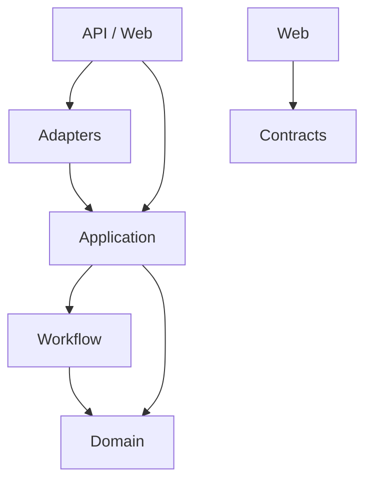
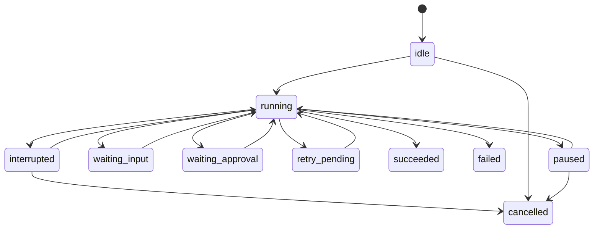

# AI SDLC Platform

## Architecture, V0.1 specification, and task breakdown

**Status:** approved implementation baseline  
**Updated:** 2026-09-14  
**V0.1 stack:** Node.js 26, TypeScript, Fastify, React, Vite, pnpm workspaces  
**V0.1 execution:** one process, direct in-process orchestration, local filesystem state and artifacts  
**Backlog:** PostgreSQL, Redis, BullMQ, worker process, Docker, Jira, Bitbucket, Telegram, SSH environments

---

## 1. Purpose

The platform automates a software-development workflow with AI agents while keeping workflow control, approvals, privileged actions, and durable decisions outside the AI runtime.

The target user flow is:

```text
task
  → analysis
  → technical plan
  → human approval
  → implementation
  → verification
  → AI review
  → bounded fix loop
  → ready for human review
```

The deterministic application controls which step runs next. An AI agent performs a bounded role inside a step; it does not own the workflow.

---

## 2. Delivery versions

### V0.1 — local single-process MVP

V0.1 proves the workflow and the Codex integration with the minimum infrastructure:

- one Node.js process for the API and workflow execution;
- Fastify API;
- React/Vite control UI;
- Codex App Server adapter using an existing ChatGPT/Codex login;
- local Git worktrees;
- local filesystem run state and artifacts;
- manual approval through the UI/API;
- verification with `lint`, `typecheck`, and `build`;
- no automated tests;
- no queue, Redis, BullMQ, worker, PostgreSQL, or Docker.

V0.1 may run work asynchronously inside the API process, but this is not a durable queue. A process crash may interrupt an active step. The saved local state must make the interruption visible and allow a manual retry or resume.

### V0.2 — persistent execution platform

V0.2 is backlog until the V0.1 golden path works:

- PostgreSQL as the source of truth;
- separate API and worker processes;
- Redis + BullMQ for job delivery;
- transactional outbox and recovery;
- Docker packaging and Compose;
- restart-safe workflow execution;
- stronger concurrency and idempotency guarantees.

### Later connectors

Attach external providers through ports/adapters after the core flow is proven:

1. Bitbucket.
2. Telegram.
3. Jira.
4. SSH development environment.

Production deployment always requires a separate policy and human approval.

---

## 3. Approved decisions

| Area | Decision | Notes |
| --- | --- | --- |
| Monorepo | pnpm workspaces | No Nx or Turborepo in V0.1. |
| Runtime | Node.js 26 | Deliberate choice even while the release is Current rather than LTS. |
| Backend | Fastify | No NestJS, decorators, Nest modules, or Nest DI. |
| Worker | None in V0.1 | Execution happens in the API process. |
| Backend modules | CommonJS | ESM is not an architectural requirement. |
| Frontend modules | Vite defaults | The web toolchain may use ESM as required by Vite. |
| Tests | Not part of MVP | No Vitest, Jest, unit, integration, or E2E test setup. |
| Verification | Lint + typecheck + build + manual smoke checks | Automated tests are backlog. |
| V0.1 state | Local filesystem | Human-readable JSON/Markdown artifacts. |
| V0.2 database | PostgreSQL | Deferred until the local workflow works. |
| V0.2 queue | BullMQ backed by Redis | Deferred; BullMQ is the queue library, Redis is its storage. |
| Workflow | Deterministic state machine | AI cannot choose arbitrary next actions. |
| Agent | Provider-neutral port | First adapter is Codex App Server. |
| Artifacts | Versioned local files | Replaceable by object storage later. |
| IDs | Application-generated UUIDs | Provider-independent identifiers. |
| UI updates | REST + SSE | WebSocket is unnecessary for V0.1. |

### When to reconsider Nx or another task runner

Only reconsider after there is measurable pain:

- CI repeatedly rebuilds many unchanged packages;
- affected-project detection materially reduces CI time;
- the repository grows to many independently built applications/packages;
- remote build cache provides a clear benefit.

The package boundaries in this document remain compatible with adding a task runner later.

---

## 4. Repository structure

### V0.1 structure

```text
ai-sdlc-platform/
├── apps/
│   ├── api/                       # Fastify API and V0.1 composition root
│   └── web/                       # React control UI
│
├── packages/
│   ├── domain/                    # Entities, value objects, domain events
│   ├── application/               # Use cases and external ports
│   ├── workflow/                  # Deterministic state machine
│   ├── contracts/                 # API/event DTOs shared with web
│   ├── config/                    # Typed configuration
│   ├── observability/             # Logger and correlation context
│   ├── workspace/                 # Git worktrees and command execution
│   │
│   └── adapters/
│       ├── agent-codex/           # Codex App Server protocol only
│       ├── storage-filesystem/    # Local task/run/artifact storage
│       └── secret-env/            # Environment-backed secrets
│
├── workflows/                     # Version-controlled workflow definitions
├── skills/                        # Platform-generic AI skills
├── docs/
│   ├── adr/
│   └── tasks/
├── .data/                         # Runtime data, ignored by Git
├── pnpm-workspace.yaml
├── package.json
├── tsconfig.base.json
├── eslint.config.*
├── .env.example
└── README.md
```

### Deferred structure

The following paths must not be created until their backlog tasks begin:

```text
apps/worker
packages/database
packages/queue
packages/testkit
packages/adapters/issue-jira
packages/adapters/scm-bitbucket
packages/adapters/notification-telegram
packages/adapters/environment-ssh
deploy/docker
compose.yaml
```

### Workspace configuration

```yaml
packages:
  - apps/*
  - packages/*
  - packages/adapters/*
```

Internal dependencies use the workspace protocol:

```json
{
  "dependencies": {
    "@ai-sdlc/application": "workspace:*",
    "@ai-sdlc/domain": "workspace:*"
  }
}
```

### Root scripts

```json
{
  "scripts": {
    "dev": "pnpm -r --parallel --filter './apps/*' dev",
    "dev:api": "pnpm --filter @ai-sdlc/api dev",
    "dev:web": "pnpm --filter @ai-sdlc/web dev",
    "lint": "pnpm -r --if-present lint",
    "typecheck": "pnpm -r --if-present typecheck",
    "build": "pnpm -r --if-present build",
    "check": "pnpm lint && pnpm typecheck && pnpm build"
  }
}
```

There is intentionally no `test` command in V0.1.

---

## 5. Module and TypeScript policy

Backend applications and packages use CommonJS.

Recommended backend baseline:

```json
{
  "compilerOptions": {
    "target": "ES2023",
    "module": "Node16",
    "moduleResolution": "Node16",
    "strict": true,
    "declaration": true,
    "sourceMap": true,
    "skipLibCheck": true
  }
}
```

Backend package manifests do not set `"type": "module"`. The web application uses a separate Vite-compatible TypeScript configuration and may use ESM.

Every package exposes a public entry point through `exports`. Consumers must not import private `src/*` paths from another package.

---

## 6. Dependency rules



Hard rules:

1. `domain` imports no application, framework, filesystem, HTTP, database, queue, or provider package.
2. `workflow` may import `domain`.
3. `application` may import `domain` and `workflow` and defines provider ports.
4. Adapters implement application ports and must not import other adapters.
5. `apps/api` is the V0.1 backend composition root.
6. `apps/web` imports `contracts`, never backend implementations.
7. Packages must not import applications.
8. Circular package dependencies are forbidden.
9. Provider-specific DTOs and metadata do not leak into the domain.

Enforce practical rules with ESLint `no-restricted-imports`. A cycle detector can be added if configuration remains small; do not add a large build system for this purpose.

---

## 7. Core domain

### Main concepts

| Concept | Responsibility |
| --- | --- |
| `Project` | Repository instructions, role mapping, workflow and policy configuration. |
| `Repository` | Local repository identity and workspace rules. |
| `Task` | Provider-neutral work request. |
| `WorkflowDefinition` | Versioned sequence/graph of steps. |
| `WorkflowRun` | Lifecycle and current phase/status. |
| `WorkflowStep` | One logical workflow unit. |
| `StepAttempt` | One execution attempt for a step. |
| `AgentSession` | Provider-neutral agent session metadata. |
| `Artifact` | Versioned analysis, plan, diff, verification output, review, or summary. |
| `Question` / `Decision` | Missing information and durable answer. |
| `Approval` | Human decision bound to exact artifact versions. |
| `Event` | Append-only description of an important change. |

Pull requests, environments, and deployments remain domain concepts, but their implementation is backlog after V0.1.

### Phase and status

```ts
export type WorkflowPhase =
  | 'intake'
  | 'analysis'
  | 'planning'
  | 'implementation'
  | 'verification'
  | 'review'
  | 'finalization';

export type RunStatus =
  | 'idle'
  | 'running'
  | 'interrupted'
  | 'waiting-for-input'
  | 'waiting-for-approval'
  | 'retry-pending'
  | 'paused'
  | 'succeeded'
  | 'failed'
  | 'cancelled';

export type StepStatus =
  | 'pending'
  | 'running'
  | 'interrupted'
  | 'waiting-for-input'
  | 'waiting-for-approval'
  | 'succeeded'
  | 'failed'
  | 'skipped'
  | 'cancelled';
```

`queued` is intentionally absent from V0.1. It may be introduced when BullMQ is implemented.

### Invariants

- A run references one immutable workflow definition version.
- Only one step is active in a V0.1 run.
- Terminal runs cannot continue.
- Approval applies to exact artifact versions.
- Changing an approved plan supersedes its approval.
- Every retry creates a new immutable `StepAttempt` record.
- Retry and review-fix loops have explicit maximums.
- Application code validates state transitions.
- An agent result cannot directly mutate workflow state.

---

## 8. Application ports

Ports live in `@ai-sdlc/application`. The interfaces below establish semantics; implementation DTOs may be refined within the relevant task.

### Agent provider

```ts
export interface AgentProvider {
  readonly providerType: string;

  getCapabilities(): Promise<AgentCapabilities>;
  createSession(input: CreateAgentSessionInput): Promise<AgentSessionHandle>;

  execute(
    session: AgentSessionHandle,
    request: AgentExecutionRequest,
  ): AsyncIterable<AgentExecutionEvent>;

  cancel(session: AgentSessionHandle): Promise<void>;
}

export interface AgentExecutionRequest {
  role: AgentRole;
  skillRefs: SkillReference[];
  workspace: WorkspaceHandle;
  inputArtifactRefs: ArtifactReference[];
  outputContract: StructuredOutputContract;
  permissions: AgentPermissionSet;
  correlation: CorrelationContext;
}
```

### Workspace and commands

```ts
export interface WorkspaceProvider {
  create(input: CreateWorkspaceInput): Promise<WorkspaceHandle>;
  inspect(handle: WorkspaceHandle): Promise<WorkspaceState>;
  diff(handle: WorkspaceHandle): Promise<GitDiffArtifact>;
  commit(handle: WorkspaceHandle, input: CommitInput): Promise<CommitInfo>;
  dispose(handle: WorkspaceHandle): Promise<void>;
}

export interface CommandRunner {
  execute(input: CommandExecutionInput): Promise<CommandExecutionResult>;
  cancel(executionId: string): Promise<void>;
}
```

### Artifacts, state, and secrets

```ts
export interface ArtifactStore {
  put(input: PutArtifactInput): Promise<ArtifactReference>;
  get(ref: ArtifactReference): Promise<ArtifactContent>;
  list(runId: string): Promise<ArtifactReference[]>;
}

export interface TaskStore {
  create(task: TaskSnapshot): Promise<void>;
  get(taskId: string): Promise<TaskSnapshot | null>;
  list(query?: TaskQuery): Promise<TaskSnapshot[]>;
}

export interface RunStore {
  create(run: WorkflowRunSnapshot): Promise<void>;
  get(runId: string): Promise<WorkflowRunSnapshot | null>;
  save(run: WorkflowRunSnapshot, expectedVersion: number): Promise<void>;
  list(query?: RunQuery): Promise<WorkflowRunSnapshot[]>;
}

export interface SecretProvider {
  resolve(ref: SecretReference): Promise<ResolvedSecret>;
}
```

### Backlog ports

These interfaces may be designed early but are not implemented in V0.1:

```ts
export interface IssueTrackerProvider { /* Jira later */ }
export interface SourceControlProvider { /* Bitbucket later */ }
export interface NotificationProvider { /* Telegram later */ }
export interface EnvironmentProvider { /* SSH later */ }
```

Do not create empty adapter packages for backlog providers merely to mirror this document.

---

## 9. V0.1 workflow engine

### Responsibilities

The workflow engine decides:

- which step is eligible;
- whether input or approval is required;
- which role and skill are requested;
- whether a retry/fix loop is permitted;
- whether the run advances or becomes terminal.

It does not:

- understand the Codex protocol;
- make provider API calls directly;
- decide Git paths or execute shell strings from model output;
- permit AI to choose arbitrary next steps;
- implement queue behavior.

### Workflow definition

```yaml
id: feature-development
version: 1

steps:
  - id: analyze
    phase: analysis
    type: agent
    role: analyst
    skill: analyze-task
    output: analysis-v1

  - id: plan
    phase: planning
    type: agent
    role: architect
    skill: design-solution
    inputs: [analysis-v1]
    output: plan-v1

  - id: approve-plan
    phase: planning
    type: approval
    approvalType: plan
    artifacts: [plan-v1]

  - id: implement
    phase: implementation
    type: agent
    role: developer
    skill: implement-change
    inputs: [analysis-v1, plan-v1]

  - id: verify
    phase: verification
    type: command-set
    commands: [lint, typecheck, build]
    retry:
      maxAttempts: 3
      strategy: agent-fix

  - id: review
    phase: review
    type: agent
    role: reviewer
    skill: review-change
    output: review-v1

  - id: fix-review
    phase: implementation
    type: agent
    role: developer
    skill: fix-review-findings
    when: review.changesRequired
    loopTo: verify
    maxIterations: 3

  - id: ready
    phase: finalization
    type: terminal
```

### In-process execution

```text
Fastify handler
  → application use case
  → save initial run state
  → start InProcessRunExecutor
  → return runId

InProcessRunExecutor
  → load run
  → evaluate next transition
  → execute one step through its port
  → save state and artifacts
  → continue until waiting or terminal
```

The executor may continue after the HTTP response using an in-process promise. This is not a durable queue. Limit V0.1 to one active step per run and a small configurable number of concurrent runs.

When the process starts, any run saved as `running` is marked `interrupted`. The UI offers an explicit retry/resume action; V0.1 does not silently replay an uncertain step.

Decision behavior is fixed for V0.1:

- approving a plan resumes the run at `implement`;
- rejecting a plan requires a comment, supersedes the current approval, and runs `plan` again with that comment as a durable decision; maximum three plan revisions;
- answering a question creates a durable `Decision` and reruns the blocked logical step as a new attempt with the answer included;
- retrying an interrupted step closes the uncertain attempt as `interrupted` and creates a new attempt; it never rewrites the old attempt.

### State progression



---

## 10. Local state and artifacts

V0.1 uses a filesystem adapter under `.data`. `.data` is ignored by Git.

```text
.data/
├── tasks/
│   └── {taskId}/
│       └── task.json
└── runs/
    └── {runId}/
        ├── state.json
        ├── events.jsonl
        ├── request/
        │   └── task-v1.md
        ├── analysis/
        │   └── analysis-v1.md
        ├── planning/
        │   └── plan-v1.md
        ├── decisions/
        │   └── decision-001.md
        ├── implementation/
        │   ├── summary-v1.md
        │   └── diff-v1.patch
        ├── verification/
        │   └── verification-v1.json
        ├── review/
        │   └── review-v1.json
        └── final/
            └── summary-v1.md
```

Rules:

- Write JSON state through a temporary file followed by an atomic rename.
- State contains a monotonic version used for optimistic updates.
- Artifacts are immutable and versioned.
- Record content type, SHA-256, byte size, logical name, and version.
- Store events append-only as JSON Lines.
- Store raw command/agent output separately from normalized summaries when useful.
- Avoid concurrent writes to the same run with an in-process per-run mutex.
- The filesystem format is an adapter implementation, not a domain assumption.

PostgreSQL later implements `RunStore` and metadata repositories without changing application use cases.

---

## 11. Roles and skills

### V0.1 roles

| Role | Permissions | Output |
| --- | --- | --- |
| Analyst | Read repository; no writes | Structured analysis + `analysis.md` |
| Architect | Read repository; no writes | Structured plan + `plan.md` |
| Developer | Write workspace; restricted shell | Code changes + implementation summary |
| Reviewer | Read repository/diff; no writes | Structured findings and decision |

There is no dedicated tester role in V0.1 because automated tests are outside the MVP.

### Role mapping

```yaml
agents:
  codex-local:
    provider: codex-app-server
    auth:
      type: subscription

roles:
  analyst: codex-local
  architect: codex-local
  developer: codex-local
  reviewer: codex-local
```

### Skill resolution

Assemble agent context in this order:

1. Platform skill from `skills/{skill}/SKILL.md`.
2. Repository-specific instructions such as `.ai/architecture.md`.
3. Current task and existing durable artifacts/decisions.
4. Step-specific output schema and permissions.

Role means who is acting; skill means how that role performs this step. Neither is a synonym for Codex or another provider.

### Structured result envelope

```ts
export interface AgentStepResult<T> {
  schemaVersion: 1;
  status: 'completed' | 'needs-input' | 'blocked' | 'failed';
  summary: string;
  data?: T;
  questions?: ProposedQuestion[];
  producedArtifacts: ProducedArtifact[];
  actions: ObservedAction[];
}
```

Application code validates the envelope. A model may propose a question or finding; only application code creates the domain entity and moves the workflow.

---

## 12. Codex App Server adapter

The adapter owns:

- process/connection lifecycle;
- thread/session creation and continuation;
- request and streaming-event mapping;
- approval event mapping;
- cancellation and timeouts;
- structured output parsing/validation;
- provider/model/usage metadata when available.

It does not own:

- workflow progression;
- role policy;
- Git branch/worktree policy;
- artifact naming;
- Jira, Bitbucket, Telegram, or SSH logic;
- retry limits for business steps.

### Authentication

V0.1 uses an existing authenticated local Codex profile:

```ts
type CodexAuthConfig =
  | { type: 'subscription'; profile?: string }
  | { type: 'api-key'; secretRef: string };
```

The database and queue do not exist in V0.1, but the configuration still stores references rather than raw API secrets. API-key mode remains optional and is not required to complete V0.1.

---

## 13. Workspace and command execution

### Workspace

- One Git worktree and branch per workflow run.
- Worktree paths are derived and validated by application code.
- Commands run as the current non-root user.
- Record argv, cwd, start/end time, exit code, and output artifact.
- Never derive an arbitrary privileged command from AI text.
- Clean disposal is explicit; do not delete a workspace containing uncommitted work without user confirmation/policy.

### Verification commands

Repository configuration defines argument arrays:

```yaml
commands:
  lint:
    argv: [pnpm, lint]
    timeoutSeconds: 300
  typecheck:
    argv: [pnpm, typecheck]
    timeoutSeconds: 300
  build:
    argv: [pnpm, build]
    timeoutSeconds: 900
```

V0.1 does not run automated tests. A repository may already contain its own tests, but the platform MVP does not require, generate, configure, or automatically execute them.

---

## 14. Fastify API

### Foundation endpoint

```text
GET /health/live
```

```json
{ "status": "ok" }
```

### V0.1 workflow endpoints

```text
POST   /api/v1/tasks
GET    /api/v1/tasks/:taskId

POST   /api/v1/workflow-runs
GET    /api/v1/workflow-runs
GET    /api/v1/workflow-runs/:runId
GET    /api/v1/workflow-runs/:runId/events
GET    /api/v1/workflow-runs/:runId/artifacts
POST   /api/v1/workflow-runs/:runId/pause
POST   /api/v1/workflow-runs/:runId/resume
POST   /api/v1/workflow-runs/:runId/cancel
POST   /api/v1/workflow-runs/:runId/retry

GET    /api/v1/approvals/:approvalId
POST   /api/v1/approvals/:approvalId/approve
POST   /api/v1/approvals/:approvalId/reject

GET    /api/v1/questions/:questionId
POST   /api/v1/questions/:questionId/answer

GET    /api/v1/artifacts/:artifactId/content
```

Use SSE for the run-events endpoint. The UI refetches normalized state after an event, keeping reconnection simple.

V0.1 is local/trusted use. Public authentication, rate limiting, external webhooks, and multi-user authorization are backlog.

---

## 15. React UI

V0.1 pages:

1. Runs list with phase, status, task and attention indicator.
2. Create task/start run.
3. Run detail with timeline, current step and artifacts.
4. Plan approval/rejection.
5. Question answer form.
6. Diff, verification results and AI review.
7. Pause/resume/retry/cancel controls.

Frontend stack:

- React + Vite.
- React Router.
- TanStack Query for server state.
- SSE client for invalidating/refetching run queries.
- `@ai-sdlc/contracts` for shared DTO types.
- No global state library until a real client-only state problem exists.
- No UI component framework is required for V0.1.

---

## 16. Secrets and safety

### V0.1 secrets

```yaml
agents:
  codex-local:
    auth:
      type: subscription
```

If an API key is later used:

```yaml
agents:
  codex-api:
    auth:
      type: api-key
      secretRef: OPENAI_API_KEY
```

Rules:

- Resolve secrets just in time in the responsible adapter.
- Never persist secret values in artifacts, events, prompts, or logs.
- Redact configured secret patterns before writing output.
- Never provide future Jira, Bitbucket, Telegram, or SSH credentials to the coding agent runtime.
- Privileged external actions remain platform-owned adapter calls.

---

## 17. Observability and audit

Every relevant log/event includes:

```text
correlationId
taskId
workflowRunId
workflowStepId
stepAttemptId
agentSessionId
```

V0.1 requirements:

- structured JSON logs;
- correlation propagation through Fastify and the in-process executor;
- secret redaction;
- events for run/step/approval/decision lifecycle;
- raw output retained as artifacts when it would make application logs excessive;
- operator-visible interrupted/failed states.

Retain inputs, outputs, configured role/skill, provider metadata, observed commands/actions and approvals. Do not require or claim storage of private model chain-of-thought.

---

## 18. V0.1 failure behavior

| Failure | V0.1 behavior |
| --- | --- |
| API process stops during a step | On startup mark uncertain `running` work as interrupted; require explicit retry/resume. |
| Agent timeout | Cancel the provider session, save partial output, mark the attempt failed. |
| Invalid structured AI output | Request one output repair; fail visibly if still invalid. |
| Lint/typecheck/build failure | Run a bounded developer-fix loop, maximum three attempts. |
| Review requests changes | Return to developer, then verify and review again; maximum three iterations. |
| Approval rejected | Require a comment, supersede the approval, save the comment as a decision, and rerun planning; stop after three plan revisions. |
| Agent asks a question | Save the question and wait; after an answer, create a decision and rerun the blocked step as a new attempt. |
| Workspace has unsafe/unexpected changes | Stop and require human attention. |
| Artifact/state write fails | Stop progression; never pretend the step succeeded. |

Cancellation is cooperative first and forced after a timeout. V0.1 does not automatically replay an uncertain external or agent action.

---

## 19. MVP validation policy

Automated tests are explicitly outside V0.1. This includes test frameworks, test files, coverage configuration, test containers, mocks, and CI test stages.

Each task instead includes a manual acceptance checklist. At the end of every task, the coding agent must report:

1. Files changed.
2. Commands executed.
3. `lint`, `typecheck`, and `build` results where available.
4. Manual smoke checks performed.
5. Deviations and unresolved issues.
6. Confirmation that it did not implement the next task.

Automated tests are a post-MVP backlog item. When introduced, prioritize workflow state transitions, persistence/idempotency, Git workspace safety, and provider contract suites.

---

## 20. V0.1 golden path

```text
Create task manually
  → start workflow through API/UI
  → Analyst produces analysis-v1
  → Architect produces plan-v1
  → workflow waits
  → human approves exact plan version
  → create Git worktree and branch
  → Developer implements the plan
  → run lint + typecheck + build
  → Reviewer evaluates the diff
  → bounded fix loop if required
  → store final summary
  → mark run succeeded and ready for human review
```

V0.1 stops before push, pull request creation, environment deployment, and Jira updates.

---

## 21. Task execution rules for coding agents

Every coding task must be provided with:

- this document as architectural context;
- one exact task section from the breakdown below;
- the current repository state;
- any decisions/artifacts produced by previous tasks.

The coding agent must:

- implement only the selected task;
- treat the task's non-goals as hard boundaries;
- inspect existing files before editing;
- preserve unrelated user changes;
- use approved stack decisions without reopening them;
- stop if a missing decision materially changes public contracts or architecture;
- finish with the required validation report.

Do not ask an agent to “implement this whole specification.”

---

## 22. V0.1 task map

| Task | Goal | Depends on | Status | Result |
| --- | --- | --- | --- | --- |
| `TASK-001` | Repository foundation | — | DONE | Buildable pnpm monorepo with Fastify and React skeletons |
| `TASK-002` | Domain and workflow model | 001 | DONE | Pure TypeScript entities, transitions and errors |
| `TASK-003` | Local state and artifact storage | 002 | NOT DONE | Filesystem `TaskStore`, `RunStore`, and `ArtifactStore` |
| `TASK-004` | Git workspace and command runner | 001 | NOT DONE | Safe worktree lifecycle and verification execution |
| `TASK-005` | Codex App Server adapter | 001, 003, 004 | NOT DONE | Provider-neutral Codex sessions and structured results |
| `TASK-006` | In-process orchestration and API | 002–005 | NOT DONE | End-to-end backend flow with approval/resume |
| `TASK-007` | React control UI | 006 | NOT DONE | Usable local control plane |
| `TASK-008` | Golden-path hardening | 006, 007 | NOT DONE | Manually verified V0.1 release candidate |

`TASK-003` and `TASK-004` may be implemented in either order. All other tasks should remain sequential unless their contracts are already stable.

---

## 23. TASK-001 — Repository foundation

**Status:** DONE.

**Acceptance evidence:** The workspace installs, `pnpm lint`, `pnpm typecheck`, `pnpm build`, and
`pnpm check` pass; the Fastify health endpoint returned HTTP 200 with `{ "status": "ok" }`; the
compiled Vite bundle served the project name. Validation was run under Node 24 with the documented
Node 26 engine warning because Node 26 is not installed in the execution environment.

### Goal

Create the pnpm monorepo and buildable application/package skeletons.

### Scope

- Require Node.js 26 and pin pnpm through `packageManager`.
- Create `apps/api` using Fastify.
- Create `apps/web` using React and Vite.
- Create packages: `domain`, `application`, `workflow`, `contracts`, `config`, `observability`.
- Configure backend CommonJS and frontend Vite module settings.
- Configure strict TypeScript, ESLint and formatting.
- Enforce the initial import boundaries.
- Implement `GET /health/live` returning `{ "status": "ok" }`.
- Add graceful API shutdown and structured logging.
- Add root `dev`, `lint`, `typecheck`, `build`, and `check` scripts.
- Document setup and package boundaries in README.
- Add ADRs for pnpm-without-Nx and dependency direction.

### Acceptance

- Fresh clone installs with `pnpm install`.
- `pnpm lint`, `pnpm typecheck`, `pnpm build`, and `pnpm check` succeed.
- API starts and `/health/live` returns HTTP 200 with the required JSON.
- Web application starts and displays the project name.
- No package imports a forbidden layer.

### Non-goals

- Workflow/domain implementation beyond minimal public package entry points.
- Codex or other adapters.
- Database, Redis, BullMQ, worker, Docker.
- Automated tests or test framework configuration.
- Authentication or production deployment.

---

## 24. TASK-002 — Domain and workflow model

**Status:** DONE.

**Acceptance evidence:** Pure domain entities, typed errors, immutable workflow transitions, exact
plan-artifact approval binding, approval superseding, bounded retry/review loops, domain events, and
application ports are implemented. `pnpm --filter @ai-sdlc/workflow scenario` passed the golden path
and limit scenarios; `pnpm check` passed. No automated test framework or later task was added.

### Goal

Implement the framework-independent model and deterministic transitions.

### Scope

- Implement `Task`, `WorkflowDefinition`, `WorkflowRun`, `WorkflowStep`, `StepAttempt`, `ArtifactReference`, `Question`, `Decision`, and `Approval` models.
- Implement phase/status types and domain errors.
- Implement transition functions without filesystem, HTTP, agent, or framework dependencies.
- Implement plan-version approval binding and superseding.
- Implement retry and review-loop counters with maximum limits.
- Define domain events returned from transitions.
- Define application ports required by later tasks.
- Provide a small executable/manual scenario or development script demonstrating transitions; do not add a test framework.

### Acceptance

- The manual scenario demonstrates start → analysis → planning → waiting approval → approval → implementation → verification → review → success.
- Invalid transitions return explicit typed errors.
- A changed plan supersedes an earlier approval.
- Retry/fix iteration limits are enforced.
- `domain` remains dependency-free and `workflow` imports only permitted packages.
- `pnpm lint`, `pnpm typecheck`, and `pnpm build` succeed.

### Non-goals

- Persistence or file formats.
- Fastify routes.
- Codex execution.
- Git commands.
- Automated tests.

---

## 25. TASK-003 — Local run and artifact storage

### Goal

Implement V0.1 filesystem persistence behind application ports.

### Scope

- Create `storage-filesystem` adapter.
- Implement `TaskStore`, `RunStore`, and `ArtifactStore` using `.data/tasks/{taskId}` and `.data/runs/{runId}`.
- Use atomic temporary-write + rename for state snapshots.
- Add monotonic state versions and optimistic update checks.
- Write append-only `events.jsonl`.
- Store artifact metadata, hashes, sizes and immutable versions.
- Validate identifiers and paths to prevent directory traversal.
- Add configuration for the data root.
- Provide a manual storage demonstration script.

### Acceptance

- A task and run can be created, saved, loaded and listed after restarting the demonstration process.
- Stale expected versions are rejected.
- Two versions of the same logical artifact remain independently readable.
- Invalid/path-traversal identifiers are rejected.
- Corrupt or missing state produces an explicit error rather than silent reset.
- `pnpm lint`, `pnpm typecheck`, and `pnpm build` succeed.

### Non-goals

- PostgreSQL, Kysely, migrations, Redis, BullMQ or outbox.
- Distributed/concurrent writers.
- Cloud/object storage.
- Automated tests.

---

## 26. TASK-004 — Git workspace and command runner

### Goal

Safely create isolated worktrees and run configured verification commands.

### Scope

- Implement `WorkspaceProvider` with one Git worktree/branch per run.
- Define deterministic, sanitized branch and directory naming.
- Inspect initial repository status before modifying it.
- Implement workspace state and diff collection.
- Implement a command runner using argv arrays, explicit cwd and timeout.
- Capture stdout/stderr, exit code and duration.
- Support cooperative cancellation followed by forced termination timeout.
- Implement configured `lint`, `typecheck`, and `build` commands.
- Prevent deletion of workspaces with unexpected/uncommitted changes unless explicitly allowed.
- Provide a manual demonstration against a temporary fixture repository without adding a test framework.

### Acceptance

- A worktree and branch are created in configured roots.
- Verification commands run only inside the intended workspace.
- Timeout/cancellation terminates the process tree.
- Diff and command-result artifacts can be produced.
- Unsafe path/cwd/cleanup requests are rejected.
- `pnpm lint`, `pnpm typecheck`, and `pnpm build` succeed.

### Non-goals

- Bitbucket push or PR creation.
- AI implementation.
- Docker isolation.
- Automated tests.

---

## 27. TASK-005 — Codex App Server adapter

### Goal

Implement the first `AgentProvider` without leaking Codex protocol into core packages.

### Scope

- Connect to/start Codex App Server through the adapter.
- Use an existing local subscription login by default.
- Implement session/thread creation and continuation.
- Map streaming provider events to normalized `AgentExecutionEvent` values.
- Implement cancellation and configurable timeouts.
- Map required tool approval events through a provider-neutral callback.
- Validate structured `AgentStepResult` output.
- Permit one structured-output repair attempt.
- Record provider/model/session metadata without secrets.
- Demonstrate analyst execution against a local fixture repository.

### Acceptance

- An analyst request produces a validated normalized result and artifact.
- Core packages contain no Codex-specific DTOs or imports.
- Cancellation and timeout result in a clear terminal adapter event.
- Invalid structured output is repaired once or fails explicitly.
- Existing Codex auth is reused without adding an API key requirement.
- Logs/artifacts contain no authentication secret.
- `pnpm lint`, `pnpm typecheck`, and `pnpm build` succeed.

### Non-goals

- Full workflow orchestration.
- Jira, Bitbucket, Telegram or SSH.
- Multiple agent providers/fallback.
- Queue/worker execution.
- Automated tests.

---

## 28. TASK-006 — In-process orchestration and Fastify API

### Goal

Connect the workflow, storage, workspaces and Codex adapter into a complete backend flow.

### Scope

- Implement application use cases for tasks, runs, approvals, questions and control actions.
- Implement `InProcessRunExecutor` with per-run mutual exclusion.
- Execute steps until waiting or terminal.
- Save state before and after side effects.
- Detect interrupted `running` state on API startup.
- Implement the V0.1 REST endpoints from this document.
- Implement SSE run events.
- Bind approval to exact plan artifact version.
- Implement bounded verification-fix and review-fix loops.
- Return a run ID promptly while work continues in process.

### Acceptance

- API can create a task and start a run.
- The run produces analysis and plan artifacts, then waits for approval.
- Approving the current plan resumes implementation.
- Lint/typecheck/build and review results appear as artifacts.
- Run reaches success or an explicit bounded failure state.
- Restarting during a running step results in visible interrupted state and manual retry/resume.
- Two resume requests cannot execute the same run step concurrently in one process.
- `pnpm lint`, `pnpm typecheck`, and `pnpm build` succeed.

### Non-goals

- Worker, Redis, BullMQ, PostgreSQL, outbox.
- External webhooks or production authentication.
- PR creation or deployment.
- Automated tests.

---

## 29. TASK-007 — React control UI

### Goal

Provide the minimum UI needed to operate V0.1 without direct filesystem or CLI manipulation.

### Scope

- Add runs list and run-detail routes.
- Add task creation/start-run form.
- Render timeline, current phase/status and step attempts.
- Render Markdown artifacts and verification/review summaries.
- Implement approve/reject plan actions.
- Implement question answering.
- Implement pause/resume/retry/cancel controls.
- Subscribe to SSE and refetch affected queries.
- Display interrupted/failed states and actionable error summaries.
- Use React Router, TanStack Query and shared contracts.

### Acceptance

- A user can start and control the complete backend flow through the browser.
- Approval clearly shows the exact plan artifact/version.
- The page recovers after refresh and SSE reconnect.
- Terminal, waiting, interrupted and failed states are distinguishable.
- No global state library or large UI framework is introduced without need.
- `pnpm lint`, `pnpm typecheck`, and `pnpm build` succeed.

### Non-goals

- Full product design system.
- Authentication/RBAC.
- Jira/Bitbucket/Telegram views.
- Automated UI tests.

---

## 30. TASK-008 — V0.1 golden-path hardening

### Goal

Run and document the real local end-to-end workflow and fix only issues blocking the MVP.

### Scope

- Use a small real/fixture repository and a concrete task.
- Run analysis → plan → approval → implementation → verification → review.
- Exercise one rejected/changed plan or question flow.
- Exercise one verification failure and bounded repair.
- Exercise API interruption and manual recovery.
- Review logs/artifacts for secret leakage and missing correlation IDs.
- Document local operation and troubleshooting.
- Produce a V0.1 release checklist and known-limitations list.

### Acceptance

- The golden path completes through the React UI.
- Every phase produces the expected durable local artifact.
- Approval is bound to the approved plan version.
- Interruptions and failures are visible and recoverable according to V0.1 rules.
- No queue, database, worker or Docker dependency is required.
- `pnpm lint`, `pnpm typecheck`, and `pnpm build` succeed.
- Manual results and known limitations are documented.

### Non-goals

- Adding postponed infrastructure because it would improve reliability.
- Automated test setup.
- External integrations.

---

## 31. Backlog task map

| Backlog item | Goal | Prerequisite |
| --- | --- | --- |
| `BACKLOG-101` | PostgreSQL persistence with Kysely migrations | V0.1 complete |
| `BACKLOG-102` | Transactional events/outbox and reconciliation | 101 |
| `BACKLOG-103` | Redis + BullMQ and separate worker | 101, 102 |
| `BACKLOG-104` | Docker images and Compose | 103 |
| `BACKLOG-105` | Automated domain/integration/provider tests | Stable V0.1 contracts |
| `BACKLOG-106` | Bitbucket adapter and pull requests | V0.1 complete |
| `BACKLOG-107` | Telegram notifications and approvals | V0.1 complete |
| `BACKLOG-108` | Jira task/webhook adapter | Stable task model |
| `BACKLOG-109` | SSH development environment adapter | Bitbucket flow stable |
| `BACKLOG-110` | Ephemeral isolated agent-runner containers | Worker architecture stable |
| `BACKLOG-111` | Multi-provider agents and role routing | First adapter stable |
| `BACKLOG-112` | Production policies, auth/RBAC and deploy approval | Prior security review |

---

## 32. BACKLOG-101 — PostgreSQL persistence

Replace the filesystem `RunStore` metadata implementation with PostgreSQL while keeping the filesystem artifact content adapter initially.

Expected scope:

- Kysely and SQL migrations;
- workflow/task/run/step/attempt/approval/question/event/artifact metadata tables;
- transactions and optimistic/row locking;
- restart-safe state;
- migration runner and database health checks.

PostgreSQL becomes the source of truth only after this task.

---

## 33. BACKLOG-102/103 — Outbox, Redis, BullMQ, and worker

BullMQ does not replace Redis. BullMQ provides Node.js queue semantics and stores its queue data in Redis.

```text
Fastify API
  → PostgreSQL transaction + outbox
  → outbox dispatcher
  → BullMQ API
  → Redis
  → BullMQ worker
  → Codex / commands
```

Expected scope:

- separate `apps/worker`;
- `packages/queue`;
- deterministic job IDs;
- at-least-once delivery with idempotent step attempts;
- retries, backoff, timeouts, concurrency and stalled-job handling;
- recovery/reconciliation from PostgreSQL;
- no critical workflow state stored only in Redis.

---

## 34. BACKLOG-104 — Docker

Add Docker after API/worker boundaries exist:

- API, worker and web images;
- PostgreSQL and Redis services;
- artifact/workspace volumes;
- health checks and startup ordering;
- non-root runtime users;
- no Docker socket exposed to the API.

Later, isolate each agent attempt in an ephemeral runner with resource limits and minimal credentials.

---

## 35. External connector contracts

Future connectors implement application ports:

```ts
export interface IssueTrackerProvider {
  getTask(ref: ExternalTaskRef): Promise<ExternalTask>;
  addComment(ref: ExternalTaskRef, body: RichText): Promise<ExternalComment>;
  transition(ref: ExternalTaskRef, transition: string): Promise<void>;
  verifyWebhook(request: RawWebhookRequest): Promise<VerifiedWebhook>;
}

export interface SourceControlProvider {
  getRepository(ref: ExternalRepositoryRef): Promise<RepositoryInfo>;
  pushBranch(input: PushBranchInput): Promise<BranchInfo>;
  createPullRequest(input: CreatePullRequestInput): Promise<PullRequestInfo>;
  commentPullRequest(input: PullRequestCommentInput): Promise<void>;
  getPipelineStatus(ref: PullRequestRef): Promise<PipelineStatus>;
}

export interface NotificationProvider {
  send(message: NotificationMessage): Promise<NotificationReceipt>;
  update(receipt: NotificationReceipt, message: NotificationMessage): Promise<void>;
}

export interface EnvironmentProvider {
  deploy(input: DeploymentRequest): Promise<DeploymentHandle>;
  getStatus(handle: DeploymentHandle): Promise<DeploymentStatus>;
  healthCheck(handle: DeploymentHandle): Promise<HealthCheckResult>;
  getLogs(handle: DeploymentHandle, query: LogQuery): Promise<LogBatch>;
}
```

The AI runtime never receives Jira, Bitbucket, Telegram, or SSH credentials. Privileged operations are invoked by application services through configured adapters and policies.

---

## 36. Definition of done for V0.1

V0.1 is complete only when:

- the repository uses Node.js 26 and pnpm workspaces without Nx;
- the backend uses Fastify and CommonJS;
- the React/Vite UI can operate the workflow;
- one process executes the workflow without Redis/BullMQ/worker;
- local filesystem state and artifacts survive a normal application restart;
- Codex subscription authentication works without requiring an API key;
- task → analysis → plan → approval → implementation → verification → review completes;
- verification runs lint, typecheck and build, not automated tests;
- retries/fix loops are bounded;
- interrupted steps are visible and require explicit recovery;
- core packages contain no Codex/Jira/Bitbucket/Telegram/SSH implementation knowledge;
- secrets are not written to logs, events, prompts, or artifacts;
- no PostgreSQL, Redis, BullMQ, worker, Docker or automated-test dependency is required;
- the manual golden-path checklist and known limitations are documented.

---

## 37. Immediate next action

Give the coding agent:

1. This complete document as architectural context.
2. Only `TASK-001 — Repository foundation` as the requested implementation scope.
3. The current repository state.

The completion instruction is:

```text
Implement TASK-001 only. Treat its non-goals as hard boundaries.
Do not implement TASK-002 or any backlog item.
Finish by reporting files changed, validation commands and results,
manual smoke checks, deviations, and unresolved issues.
```

After TASK-001 is reviewed, provide TASK-002 together with the updated repository state. Do not ask one agent run to implement all V0.1 tasks at once.

---

## References

- Node.js release status: <https://nodejs.org/en/about/previous-releases>
- Fastify documentation: <https://fastify.dev/docs/latest/>
- React documentation: <https://react.dev/>
- Vite documentation: <https://vite.dev/guide/>
- pnpm workspaces: <https://pnpm.io/workspaces>
